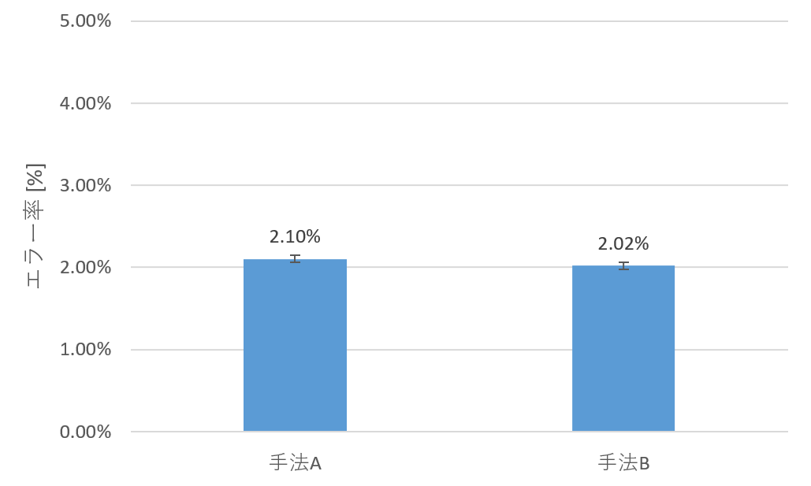

---
latex:
  baseTemplateFile: ../latex/templates/template.tex
  documentInfo:
    student_id: 2620130639
    ja:
      author: 鳥山 らいか
      title: |
        WristSlide{:} 手首を滑らせることによる\\
        スマートウォッチの片手操作手法
      affiliation: |
        明治大学 総合数理学部\\
        先端メディアサイエンス学科
      date: 2017年 3月
      thesis: 2016年度 卒業研究論文
      supervisor: 宮下 芳明 教授
    en:
      author: Raika Toriyama
      title: |
        WristSlide{:} One-handed Interaction Technique for Smartwatches\\
        using Wrist-Sliding Gesture
      affiliation: |
        Department of Frontier Media Science\\
        Faculty of Interdisciplinary Mathematical Sciences\\
        at Meiji University
      date: March 2017
      thesis: The Graduate Thesis
      supervisor: Prof. Homei Miyashita
---

# はじめに
<!--レシピアプリ完成
データ整理
実験の手法AとBの動画をとる
タイムスタンプ
実際の動作の写真
https://github.com/3846masa/Graduation-Thesis/blob/master/src/index.md-->

今日，タッチスクリーンを有するスマートウォッチが多く普及しているが，
現状の操作にはいくつかの問題点がある．
その1つに，スワイプのような連続的な入力は
スマートウォッチを装着している手のみで行うことができないという点があげられる．
これは荷物を持っている場合やユーザの手が他のタスクで忙しい場合に，
情報を見ることができるというウェアラブル端末の利点を殺してしまっている．
Microsoft Research[@msr]の福本はスマートウォッチについて，
「インタフェースとして見た場合，タッチスクリーンや小さなボタンの操作にはもう一方の手が必要であり，
使える場面が限られてしまう．」（福本，2016，p.98）[@fukumoto]と指摘している．

スマートウォッチに搭載されている装着している方の手のみで操作する手法として，
Android Wear[@wear]に搭載されている手首を返すジェスチャによる操作手法があげられる．
しかし，ジェスチャはパターンが増えるほど覚えるのが困難になる上，
行うことができるのはページをめくるといった操作のショートカットにすぎない．

スマートウォッチを片手で操作する手法について，
これまでにも多くの研究が行われてきた．
しかし，その多くが行われたジェスチャを認識し，
操作のショートカットといった不連続的な入力に割り当てるものであり，
連続的な入力を対象とはしていない．
片手での連続的なスマートウォッチの操作手法として，
近接センサによって手首の回転で操作する手法[@Gong:2016:WOC:2984511.2984563]や，
端末に内蔵した加速度センサによって腕の傾きで操作する手法[@Guo:2016:ETN:2935334.2935345]が挙げられる．
しかし，前者はセンサの値が環境光によって影響を受けるため，
一度外してから再び装着するときにキャリブレーションが必要になってしまう．
一方，後者は方向によって操作の精度が変わってしまうという問題がある．

本論文では，机や壁，自身の身体などの上で手首を滑らせることによって，
スマートウォッチを装着している手のみでの連続的な2次元方向の入力を可能にする手法を提案する．
バンド下部に小型ワイヤレスマウスを埋め込み，
手首を滑らせたときの移動量をスマートウォッチに送ることで片手のみでの入力を可能にした．
同時に，キャリブレーションの問題も解消している．

# 関連研究
提案手法は，手首を滑らせる動作によって片手でのスマートウォッチの操作手法を提案している．
また，それは同時に手首に固定されている画面自体を動かして操作することでもある．
本章では，同様にスマートウォッチを片手で操作する手法や，
画面自体を動かすことによって操作する手法に関する研究について述べる．

## 片手での不連続的な操作手法
センサによって手のジェスチャを認識し，不連続的な操作を行う研究には
[@6850687;@Dementyev:2014:WLG:2642918.2647396;@Zhang:2015:TWL:2807442.2807480;@Jing:2013:MRS:2541831.2541875;@110002711465;@Laput:2016:VHB:2984511.2984582;@myo;@clip]などがある．
Hasanらの研究[@6850687]では筋電位センサを用いて，手の静的ジェスチャを認識する．
WristFlex[@Dementyev:2014:WLG:2642918.2647396]は感圧センサのアレイを，
Tomo[@Zhang:2015:TWL:2807442.2807480]は電気インピーダンストモグラフィセンサのアレイを手首に巻くことにより，
手の静的ジェスチャを認識する．
Magic Ring[@Jing:2013:MRS:2541831.2541875]は指輪型デバイスに内蔵された加速度センサによって，
Ubi-Finger[@110002711465]は様々なセンサが搭載されたグローブを用いることで手の動的ジェスチャを認識する．
Viband[@Laput:2016:VHB:2984511.2984582]は
一般的なスマートウォッチに搭載されている加速度センサのクロック周波数を上げることで，
手の動的なジェスチャ認識やデータの受信を可能にする．
すでに商品として発売されているデバイスには，
腕に巻き付けた筋電位センサのアレイで手の動的ジェスチャを認識するMyo[@myo]や
手首に装着した生体音響信号センサで手の動的ジェスチャを認識するClip[@clip]などがある．
提案手法ではイメージセンサを用いることによって手首を滑らせたときの移動量を取得し，
連続的な操作を行うという点でこれらの研究と異なる．

## 片手での連続的な操作手法
センサによって手のジェスチャを認識し，連続的な操作を行う研究には
[@Aoyama:2016:TIT:2851581.2892435;@Gong:2016:WOC:2984511.2984563;@Guo:2016:ETN:2935334.2935345]
などがある．
ThumbSlide[@Aoyama:2016:TIT:2851581.2892435]はフォトリフレクタアレイを腕に巻き付け，
装着した手の親指が人差し指の側面でスライドした量をセンシングすることで，1次元方向の入力を可能にする．
WristWhirl[@Gong:2016:WOC:2984511.2984563]は手首に赤外線近接センサのアレイを巻くことで，
手をジョイスティックのように回転させることによる2次元方向の入力を可能にする．
この2つの研究ではセンサの値が手首の形状または環境光によって影響を受けるため，
一度外してから再び装着するときにキャリブレーションを行う必要がある．
提案手法ではキャリブレーションが必要ないという点でこれらの研究と異なる．

Guoらの研究[@Guo:2016:ETN:2935334.2935345]では，スマートウォッチに内蔵されている加速度センサを用いて，
装着している腕を傾けることでのメニュー選択や連続的入力を可能にした．
しかし，傾ける方向によって精度が変わってしまうという問題がある．

## 画面自体を動かす操作手法
大きな画面の一部を表示するのぞき窓を操作するように，
画面自体を上下左右に動かすことで画面内のコンテンツのスクロールを行う研究には
[@704324;@Yee:2003:PDP:642611.642613;@Kerber:2014:IEP:2628363.2628393]などがある．
Scroll Display[@704324]はPCに接続した小型端末にマウスのボール機構とボタンを組み込むことで，
端末の移動量に応じて画面内のコンテンツをスクロールさせることやメニューの選択を可能にした．
Peephole displays[@Yee:2003:PDP:642611.642613]は紐に固定された端末を用いて画面の移動量を測定することで，
のぞき窓操作を実現し，ペンを用いたインタラクションと組み合わせた．
Kerberらの研究[@Kerber:2014:IEP:2628363.2628393]ではマーカを付けたスマートウォッチの位置をトラッキングすることで，
のぞき窓操作を実現し，タッチ操作と比較した．
提案手法はワイヤレスマウスを用いることで，容易に動作環境を携帯することができる点や手首で操作を行う点で異なる．

# システム

## 手首を滑らせる操作手法
提案手法では机や壁，自身の身体などの上で手首を滑らせることによって，
スマートウォッチを装着している手のみでの連続的な2次元方向の入力を可能にする．
これによりユーザはスマートウォッチを装着していない側の手で荷物を持っている場合や，
手が汚れている場合にも操作が可能になる．
図[@fig:image]に提案手法の操作イメージを示す．
矢印の方向に手首を滑らせることによって，画面内のコンテンツをスクロールする．

 {#fig:image width=\linewidth,height=7truecm}

## キャリブレーションレス
圧力センサや近接センサなどを手首に装着し，手のジェスチャを認識する手法にはキャリブレーションが必要不可欠である．
ThumbSlide[@Aoyama:2016:TIT:2851581.2892435]やWristWhirl[@Gong:2016:WOC:2984511.2984563]では，
着脱時にキャリブレーションを行う必要がある．
また，WristFlex[@Dementyev:2014:WLG:2642918.2647396]では，
1度だけキャリブレーションを行ってから着脱を繰り返した場合，ジェスチャの認識精度が下がっていくことを示した．
提案手法では，原理上，キャリブレーションを行う必要がない．

# 実験用プロトタイプ{#sec:prototype0}
本章では，スマートフォン2台と小型赤外線ワイヤレスマウスを用いた，実験用プロトタイプの実装や操作手法について述べる．
説明のため，マウスとペアリングする1台目のスマートフォンをA，
スマートウォッチの代わりとして腕に装着する2台目のスマートフォンをBと呼ぶことにする．

## 実装
まずマウスをスマートフォンAにBluetooth接続し，スマートフォンAのアプリケーションでマウスの移動量を取得する．
このアプリケーションでは，自端末にデバッグ接続することでマウスによる入力情報を監視する．
取得した値はスマートフォンAからスマートフォンBに，UDP通信を用いて10ms毎に送信する．
スマートフォンBでは受信した値をアプリケーション画面に反映させる．

バンド下部にマウス収納用の箱を設置し，マウスを収納した（図[@fig:band]）．
スマートフォンBの画面の傾きを緩和するため，端末下部と腕の間にスポンジを挟み，
バンドで腕の上に固定した（図[@fig:wearing]）．

 {#fig:band width=\linewidth,height=5truecm}

 {#fig:wearing width=\linewidth,height=5truecm}

<!-- px * 25.4/423 = mm -->

マウスにはELECOM社製CAPCLIP（M-CC1BRWH）を使用した．
スマートフォンAはASUS社製ZenFone2（ZE551ML-GY32，Android v5.0）を使用し,
アプリケーションはKotlin（Android Studio v2.2.3）で実装した．
スマートフォンBはLG社製Nexus5X（LG-H791，Android v7.1.1）を使用し，
ディスプレイ解像度は1920$\times$1080 pixels（115.3 mm$\times$64.9 mm, 423 ppi）であった．
実験システムとなるアプリケーションはProcessing（Processing for Android v3.0.1）によって実装した．

## 操作手法

手首を滑らせることによる2次元のポインティング操作には2つの方式が考えられる．
1つは画面内でカーソルを動かし，コンテンツ内にあるターゲットに誘導する方式である．
もう1つはコンテンツ全域をスクロールし，画面上に固定したカーソルまでターゲットを誘導する方式
（以下，MovableBackground方式[@Suzuki:2015:FSC:2815585.2815728]）である．

スマートウォッチの画面は小さいため，情報の閲覧には多くの場合にスクロール操作が求められる．
前者ではカーソルは画面内を動くため，複数回のスクロール操作が必要になる．
これは現状のタッチスクリーンを用いた操作において，指で画面を複数回スワイプする状況と似ている．
一方，後者のMovableBackground方式では，より長い距離を1度にスクロールすることができるため，
前者に比べて，より速く操作することができると推測される．

したがって，MovableBackground方式を採用した2つの操作手法を考案した．
図[@fig:ab]に手法AとBの操作の違いを示す．図中の矢印は手首及び画面を動かす向きを表す．

### 手法A
画面の中心に十字の固定カーソルを表示し，手首を動かした向きと上下左右が反転した向きにコンテンツ全域を動かす．
画面は手首に固定されているため，コンテンツがその場に留まろうとするような動作になる．

### 手法B
画面の中心に十字の固定カーソルを表示し，手首を動かした向きと上下左右が同じ方向にコンテンツ全域を動かす．
画面は手首に固定されているため，コンテンツ全域を手首で押しやるような動作になる．
手法Aとは180度，逆向きの操作となる．

 {#fig:ab width=\linewidth,height=10truecm}

# 操作性能評価実験
提案手法のユーザビリティを評価するため，ポインティングタスクを実施した．
ここではフィッツの法則[@Fitts:1954]における操作性能（パフォーマンス）を検証する．
同時に，第[@sec:prototype0]章で述べた手首を滑らせることによって操作する2つの手法を比較する．

## フィッツの法則
Fittsは人間が行うポインティングにおいて，
操作時間と操作精度にはトレードオフの関係があることを定式によってモデル化した[@Fitts:1954]．
これはフィッツの法則として，HCIのポインティング性能の尺度に幅広く用いられている．
フィッツの法則をベースとした操作性能の定式としては，
一般にMacKenzieの提唱した以下の定式[@doi:10.1080/00222895.1989.10735486]が利用されている．

$$MT = a + b \log_2\left( \frac{A}{W} + 1 \right)$$ {#eq:fitts}

このとき，$MT$は操作を完了するまでの時間， $a$と$b$は実験によって決定される定数， 
$A$は経路長，$W$はターゲット幅と定義される． 
また，$\log_2\left( \frac{A}{W} + 1 \right)$を $ID$（Index of Difficulty）と呼び，
この値が大きくなるほどポインティングの難度が増すことを示す．
すなわち，経路長$A$を短くするか，ターゲット幅$W$を大きくすることで，操作時間が短縮すると推測される．

## 実験

### 参加者
本実験では6人の男性のボランティアが参加した．
平均年齢は22.2歳，標準偏差は1.21歳であり，6人中5人が右利き，1人が左利きであった．
全員に肘上まで腕をまくるよう指示し，左手に実験用デバイスを装着した．
条件を同じにするため，全員が用意された木製の板（280.5 mm$\times$336.0 mm）の上でタスクを行った．
この時，ディスプレイの上部が手首により近い方になるように固定する（図[@fig:experiment]）．

 {#fig:experiment width=\linewidth,height=5truecm}

### 実験デバイス
実験には，第[@sec:prototype0]章で述べた実験用プロトタイプを使用した．
片手でクリック操作を行うため，マウス基板上のクリック用スイッチを延長した．
スマートフォンBの画面の傾きを緩和するため，端末下部と腕の間にスポンジを挟み，
バンドで腕の上に固定した（図[@fig:wearing]）．
板と机の間に滑り止めシートを敷くことで，実験中に板自体が動いてしまうことを防止した．

### タスク
腕の上に固定したスマートフォンBの画面上部（実験参加者から見て右側）に
スマートウォッチの画面を模した円（以下，疑似画面）を表示する．
疑似画面の中にはターゲットである11個の円と，十字のカーソルが表示される（図[@fig:device]）．
実験参加者は用意された木製の板の上で手首を滑らせ，コンテンツ全域を動かして操作する．
なお，コンテンツ全域は移動するが，疑似画面の中のみ表示される．
画面に固定された十字カーソルを赤い円のターゲットに合わせてクリックすると，次のターゲットが赤く表示される．
ターゲットが選ばれる順番は図[@fig:aw]に示すとおりである．

実験では，第[@sec:prototype0]章で述べた，
手首を滑らせることによって操作する2つの手法A，Bのポインティング性能の評価と比較を行う．
この際，実験参加者には出来る限り速く，かつ正確に操作を行うよう指示した．
実験中のクラッチ（手首を持ち上げて繰り返し移動入力をする）操作は禁止した．

 {#fig:device width=\linewidth,height=5truecm}

 {#fig:aw height=0.25\paperheight}

### 実験デザインと操作手順
<!--px * 25.4/423 = mm-->

疑似画面の直径を900 pixels (54.0 mm)，
ターゲット間の距離$A$を324, 512, 756 pixels (19.5, 30.7, 45.4 mm)，
ターゲットの直径$W$を，52, 68, 86 pixels (3.1，4.1，5.2 mm)に設定する（図[@fig:aw]）．
パラメータの組み合わせは，3($A$)$\times$3($W$)=9種類である．

十字カーソルは，はじめに疑似画面の中心に位置している．
カーソルを移動させて1番から11番までの円を連続でクリックしていき，
最後に1番の円をもう一度クリックする．
合計で12回$\times$9種類のパラメータ=108回，クリックするのを1セットとした．
ターゲットの外をクリックした場合は，エラーと数え，次のターゲットを赤く表示する．
1セット終えた後は，手を板の真ん中に移動させ，もう一度クリックすると次のパラメータの組み合わせが表示される．
パラメータの組み合わせはランダムな順序で選出した．
なお，手法間で手首を動かす向きの組み合わせが同じになるよう，手法Bでは疑似画面内のコンテンツを180度回転させている．

実験参加者を手法Aから行うグループと手法Bから行うグループに半数ずつに分けた．
実験参加者は1つ目の手法を1セット練習した後に，続けて本番を2セット行った．
各セットの間には1分間の休憩を挟み，2つ目の手法にうつるときには3分間の休憩を挟んだ．

実験では，前のターゲットをクリックした時間から次のクリックまでの操作時間を計測した．
パラメータの組み合わせが提示されてから最初のクリックまでは，
画面の中心から1番目のターゲットまで移動する時間のため，測定の対象外とした．
ターゲットの個数が奇数のため，移動距離が等しく，方向の異なる11個の操作時間データが得られる．
記録された実験データは，ターゲット数11個$\times$パラメータの組み合わせ
9種類$\times$2セット$\times$2手法(操作の向き)$\times$実験参加者6名=2376回分（各手法について1188回ずつ）となる．
実験は事前のインストラクションから全試行終了まで1人あたり50分程度であった．

## 結果
実験中のクラッチ動作を禁止したが，パラメータの組み合わせが変わるごとに手首を板の中心に戻させたため，
実際に板から手首をはみ出した者はいなかった．

ターゲット間の距離$A$が324 pixelsのとき，疑似画面内に常時すべてのターゲットが表示されているが，
$A$が他の2つのパラメータのとき，次のターゲットが画面内に表示されていないことになる．
しかし，画面自体を動かすことによるMovableBackground方式を用いたポインティングにおいて，
ターゲットが画面内に表示されているか否かに関係なく，フィッツの法則に従う[@704324]ため，
$A$の値に関係なく，データは一律に扱う．

### フィッツの法則の適合度の検証
図[@fig:fitts]に示すように，手法AとBの両方おいてフィッツの法則に適合していることがわかる（$R^2 > 0.93-0.94$）．
よって，手首を滑らせることによって操作する2つの手法は，どちらも一般的なポインティングとしての機能を備えているといえる．

 {#fig:fitts width=\linewidth,height=7truecm}

### 操作時間
各手法における平均操作時間を図[@fig:speed]に示す．
各手法における操作時間について，対応があるt検定を行った結果，有意な差がみられた（$t_{5} = -5.71,\ p < 0.05$）．
よって，手法Aは手法Bより操作時間が短くなるといえる．

 {#fig:speed width=\linewidth,height=5truecm}

実験中に手首を動かした11方向の方向番号を図[@fig:direction]のように定義する．
各手法において，手首を動かす方向ごとの平均操作時間を図[@fig:speed-direction]に示す．
どちらの手法においても，方向9が全方向中で最も操作時間が短いことや，
方向2や5での操作時間が角度が近い方向に比べて短いことなど，
手法AとBのグラフ形状にいくつか共通する特徴が見られる．
手首を動かす方向ごとの操作時間について分散分析を行った結果，
手法Aでは方向ごとに有意な差がみられ（$F_{10,50} = 2.16,\ p < 0.05$），
手法Bでは方向ごとに有意傾向がみられた（$F_{10,50} = 1.80,\ p < 0.10$）．
しかし，各手法において，それぞれBonferroniの手法を用いて多重比較を行った結果，
いずれの水準間の差も有意ではなかった．
以上のことから，手首を滑らせて操作を行うとき，方向によって操作速度に差がある可能性が示唆された．

 {#fig:direction width=\linewidth,height=5truecm}
 {#fig:speed-direction width=\linewidth}

### エラー率
エラー率の平均値は，手法Aの場合は$25 / 1188 = 2.10 \%$，
手法Bの場合は$24 / 1188 = 2.02 \%$であった（図[@fig:error]）．
各手法におけるエラー率について，対応があるt検定を行った結果，有意な差はみられなかった．
よって，手法間でのエラー率の差はないといえる．

また，各手法において手首を動かす方向ごとのエラー率について分散分析を行った結果，有意な差はみられなかった．
よって，どちらの手法においても，方向間でのエラー率の差はないといえる．

 {#fig:error width=\linewidth,height=5truecm}

## 考察
手法AとBのどちらの手法もフィッツの法則に適合していることがわかった．
このことから，手首を滑らせることによるMovableBackground方式の操作手法において，連続的な操作は可能であるといえる．

手法AとBを比較した場合，エラー率に差はみられなかったが，操作時間は手法Aの方が有意に短くなることがわかった．
手首を動かす向き以外には手法AとBに違いがないため，エラー率に差がみられなかったと考えられる．
また，手法Aのコンテンツがその場に留まろうとするような動作が，
ユーザにとって理解しやすかっために操作時間が短くなったと推測される．

手首を動かす方向に関して，エラー率に差はみられなかったが，操作時間には差がある可能性が示唆された．
手や腕は可動域が広いため，どの方向においても同じような精度でターゲットにカーソルを合わせることが可能であったと考えられる．
一方，筋肉のバランスや関節の向きによって手首を動かす向きに得意な方向とそうでない方向があり，
方向ごとの操作時間が変わったと推測される．
また，操作時間には手法AとBで共通する特徴がいくつか見られたが，具体的な関係を特定するには至らなかった．
これはサンプル数が十分ではなかったためと考えられる．
したがって，提案手法を用いた操作においては，
手首を動かす方向に応じて操作時間が変わるという点を考慮したインタフェース設計をするべきである．

# プロトタイプ
手首を滑らせることによるポインティングが可能であることが示されたため，
実際にスマートウォッチを使用してプロトタイプを作成した．
プロトタイプはマウスの埋め込まれたバンド，スマートフォン1台，
スマートウォッチ1台の3つの要素で構成されている．
実験システムと異なる点は，スマートフォンで読み取ったマウスの移動量を
Bluetooth接続されたスマートウォッチに送信する点である．
実験の結果から操作手法には手法Aを採用した．

マウスとスマートフォンには実験でも使用したELECOM社製CAPCLIP（M-CC1BRWH）と
ASUS社製ZenFone2（ZE551ML-GY32，Android v5.0）を用い，
スマートウォッチはHuawei社製HUAWEI WATCH（MERCURY-G00LE，Android Wear v1.5）を使用した．
スマートフォンとスマートウォッチのアプリケーション開発にはKotlin（Android Studio v2.2.3）を使用した．

# アプリケーション例
提案手法を用いて，スマートウォッチ上で動作するレシピ表示アプリを作成した（図[@fig:app]）．
ユーザは壁などで手首を滑らせることによって，
スマートウォッチを装着していない側の手で調理を行っている場合や，
手が汚れている場合にもレシピを確認することができる．
料理の写真やレシピ作成者のコメントが表示され，上下にスクロールすることで材料や調理手順を閲覧することができる．
左右にスクロールして別のレシピに切り替える．
実験の結果を踏まえ，スクロール方向に応じて別々の操作を割り当てるように設計した．

 {#fig:app width=\linewidth,height=10truecm}

# 議論

## 摩擦の影響
実験システム及びプロトタイプではマウス収納用の箱の底面が，手首を滑らせる対象と接触する．
摩擦の大きさが操作スピードに直接影響するため，箱の素材や形状は重要である．
箱の表面の素材をフッ素樹脂などのなめらかな素材にすることや，
箱の縁を曲線にすることで，よりなめらかな動作を行うことができると考えている．
また，ボールペンの先端のような構造を底面に組み込むことで，
底面全体での接地を避けることにより，摩擦を軽減できると考えている．

## バンドに取り付けるマウスの数や位置
提案手法で使用するマウスの数は，現時点でバンド下部に取り付けている1つのみである．
机や壁などで手首を滑らせる場合は画面がユーザの方を向いているが，
自身の身体で滑らせる場合には画面を斜めになる可能性が出てくる．
仮に，マウスがユーザ側のバンド側面にも設置されていた場合，より画面の見やすい操作が実現できる．
よって，マウスの数や取り付け位置に関しても検討の余地がある．

## 決定操作
提案手法では片手での2次元の連続的入力のみを実現している．
しかし，決定操作がなければ行うことができる操作が大きく制限されてしまうため，
決定操作を別に設定する必要がある．
実験ではマウスのクリック用スイッチを延長し，指で挟んで仮のクリック操作を実現した．
実際には，手には何も持たないで操作できるのが理想であるため，
手首を滑らせる動作と併用して行うことができ，かつ手首でセンシングできる決定動作が求められる．
手首を接地させたまま決定操作を行うことを念頭に置くと，
電界センサよって手を甲の側に曲げる動作を認識すること[@Zhou:2016:AEE:2984511.2984568]や，
圧力センサやピエゾセンサによって人差し指と親指によるピンチ動作を認識すること
[@Dementyev:2014:WLG:2642918.2647396;@Gong:2016:WOC:2984511.2984563]が考えられる．

## 入力受付状態の切り替え操作
ウェアラブル端末は身につけて日常生活を送るため，誤認識による操作を避ける必要がある．
入力を受け付ける状態と受け付けない状態を区別するために状態を切り替える操作が必要になる．
既存のスマートウォッチには一定時間操作がされていないと節電モードに入り，
時計を見る角度に腕を移動させると自動で節電モードを解除する機能がある．
これを利用することにより入力受付状態の切り替えを自然に行うことができる．
また，より誤認識を減らすために数回手首を前後に回す動作により，明示的に切り替える方法も考えられる．

# まとめ
本論文では，机や壁，自身の身体などの上で手首を滑らせることにより，
スマートウォッチを装着している手のみで2次元方向の入力を行う手法を提案した．
実装においては，スマートフォンに接続した小型ワイヤレスマウスをベルトに埋め込むことで，携帯可能な操作環境を構築した．

また，ポインティングタスクによって手首を滑らせる動作を用いたMovableBackground方式の操作手法AとBが
フィッツの法則に適合することが示された．
同時に，手法AとBを比較し，手法Aの方が有意に操作時間が短くなることが示された．
さらに，手首を滑らせる方向によって操作時間に差がある可能性が示唆された．
これらの結果に基づき，プロトタイプを作成し，アプリケーション例を示した．